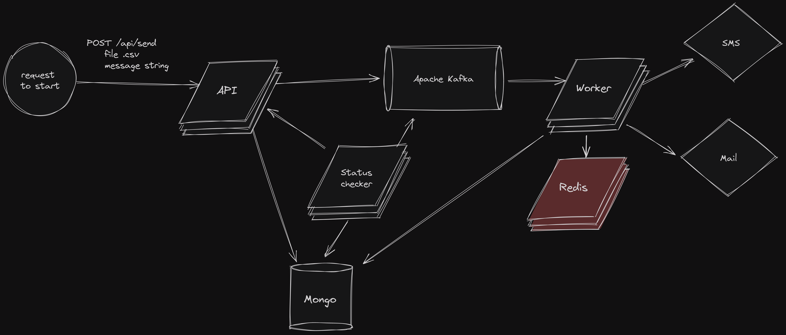

Emergency Notification System
-


How to run?
-

```
mvn install -DskipTests
```
```
docker-compose up -d --build
```
Example request
-

Send post request with form data with file and message
```
curl --location 'http://localhost:80/api/send' --form 'message="your_message"' --form 'file=@"/your-absolute-path/emergency-notification-system/testFile_1000.csv"'
```
File format accepted only .csv, example below, </br>

Headers no need, Sender Service now available only `TEST` (you can take test file in project testFile_*.csv)

| User Service Id | Sender Service |
|-----------------|----------------|
| email@gmail.com | EMAIL          |
| +380666666666   | SMS            |


How it works?
-


Mongo Scheme
-


Redis Scheme
-


Notification's Status code explain
-


