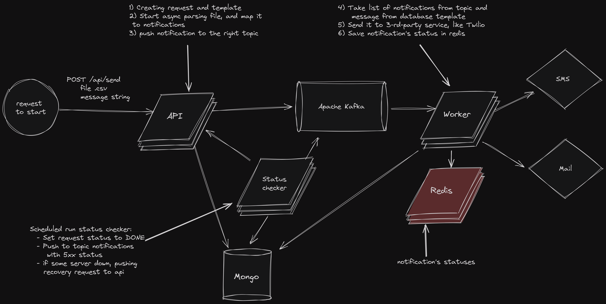

Emergency Notification System
-


Guaranteed message delivery with scalability

How to run?
-

```
git clone https://github.com/smelovd/emergency-notification-system
```
Open project folder, then run 
```
mvn install
```
```
docker-compose up -d --build
```
Example request
-

Send post request with form data with file and message
```
curl --location 'http://localhost:80/api/send' --form 'message="my_message"' --form 'file=@"/your-absolute-path/emergency-notification-system/testFile_1000.csv"'
```
File format accepted only .csv, example below, </br>

Headers no need, Sender Service now avaliable only `TEST` (you can take test file in project testFile_*.csv)

| User Service Id | Sender Service |
| -------------   | -------------  |
| email@gmail.com | EMAIL          |
| +380666666666   | SMS            |


How it work?
-



Database Schema
-

